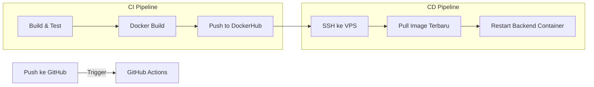

# Final Report: Deployment Loanova Backend (VPS + Docker)

Dokumen ini berisi rangkuman lengkap arsitektur, konfigurasi, dan panduan operasional untuk deployment Loanova Backend.

## 1. Arsitektur Deployment

Aplikasi berjalan di atas Docker Container di VPS dengan konfigurasi sebagai berikut:

- **Backend**: Spring Boot 3 (Port `80` - HTTP Default)
- **Database**: Microsoft SQL Server 2022 (Port `1433`)
- **Cache**: Redis (Port `6379`)
- **Monitoring**: Redis Insight (Port `5540`)

### Diagram CI/CD Pipeline


---

## 2. Konfigurasi Penting

### Port & Firewall
- **Backend** di-expose ke port **80** (bukan 9091) agar bisa diakses tanpa setting firewall tambahan di cloud provider.
- URL API: `http://136.113.170.61/api/...`
- Swagger UI: `http://136.113.170.61/swagger-ui.html`

### Penyimpanan File (Uploads)
- Menggunakan **Bind Mount Host**: `./uploads:/app/uploads`
- Folder fisik di VPS: `~/loanova/uploads`
- **Permission**: `777` (Full Access) agar container bisa menulis file.

---

## 3. Panduan Instalasi (Fresh Deployment)

Jika Anda perlu men-deploy ulang dari nol di server baru:

1. **Persiapan Folder**:
   ```bash
   mkdir -p ~/loanova/uploads
   chmod 777 ~/loanova/uploads
   cd ~/loanova
   ```

2. **Upload File**:
   - `docker-compose.prod.yml`
   - `seed_roles_fixed.sql`
   - `seed_plafonds.sql`

3. **Jalankan Container**:
   ```bash
   export DOCKER_USERNAME=agung26shosu
   docker compose -f docker-compose.prod.yml up -d
   ```

---

## 4. Setup Database Awal (Wajib)

Setelah database container berjalan untuk pertama kali, data harus di-seeding:

```bash
# 1. Insert Roles (CUSTOMER, STAFF, ADMIN)
docker exec -i sqlserver /opt/mssql-tools18/bin/sqlcmd -S localhost -U sa -P 'SHOsu2611@' -C -d loanova_db -i /dev/stdin < seed_roles_fixed.sql

# 2. Insert Plafonds (BRONZE, SILVER, GOLD)
docker exec -i sqlserver /opt/mssql-tools18/bin/sqlcmd -S localhost -U sa -P 'SHOsu2611@' -C -d loanova_db -i /dev/stdin < seed_plafonds.sql
```

_(Catatan: Jika file sql ada di host, gunakan redirect input `<` seperti di atas)_

---

## 5. Cheat Sheet Verification (Postman)

Import command berikut ke Postman (**Import -> Raw Text**) untuk test functionality.

### A. Register User
```bash
curl --location 'http://136.113.170.61/api/auth/register' \
--header 'Content-Type: application/json' \
--data-raw '{
    "username": "userfinal",
    "email": "userfinal@test.com",
    "password": "Password123!"
}'
```

### B. Login User
```bash
curl --location 'http://136.113.170.61/api/auth/login' \
--header 'Content-Type: application/json' \
--data-raw '{
    "username": "userfinal",
    "password": "Password123!"
}'
```

### C. Lengkapi Profil (Upload File)
_Ganti `<ACCESS_TOKEN>` dengan token dari login._
```bash
curl --location 'http://136.113.170.61/api/user-profiles/complete' \
--header 'Authorization: Bearer <ACCESS_TOKEN>' \
--form 'fullName="Agung Final"' \
--form 'phoneNumber="081234567890"' \
--form 'userAddress="Jl. Sudirman, Jakarta"' \
--form 'nik="1234567890123456"' \
--form 'birthDate="1995-05-20"' \
--form 'ktpPhoto=@"/path/to/ktp.jpg"' \
--form 'profilePhoto=@"/path/to/selfie.jpg"'
```

---

## 6. Troubleshooting & Maintenance

### Update Aplikasi
Cukup push code ke branch `main` di GitHub. GitHub Actions akan otomatis meng-update server (~2-3 menit).

### Masalah Upload File Gagal
Cek permission folder uploads:
```bash
ls -ld ~/loanova/uploads
# Harusnya: drwxrwxrwx ...
# Jika bukan, jalankan: chmod 777 ~/loanova/uploads
```

### Masalah Database / Error Login
Cek apakah data roles/plafonds hilang (misal container terhapus valume-nya):
```bash
docker exec -it sqlserver /opt/mssql-tools18/bin/sqlcmd -S localhost -U sa -P 'SHOsu2611@' -C -d loanova_db -Q "SELECT count(*) FROM roles"
```
Jika `0`, jalankan langkah **Setup Database Awal** lagi.

### Cek Logs
```bash
docker logs -f spring-app --tail 100
```
